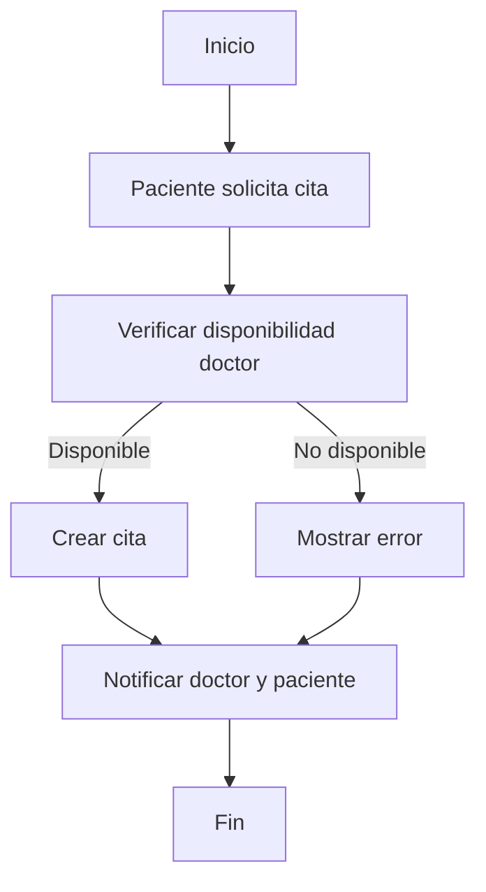

```mermaid
flowchart TD
    A[Inicio] --> B[Paciente solicita cita]
    B --> C[Verificar disponibilidad doctor]
    C -->|Disponible| D[Crear cita]
    C -->|No disponible| E[Mostrar error]
    D --> F[Notificar doctor y paciente]
    E --> F
    F --> G[Fin]
```
