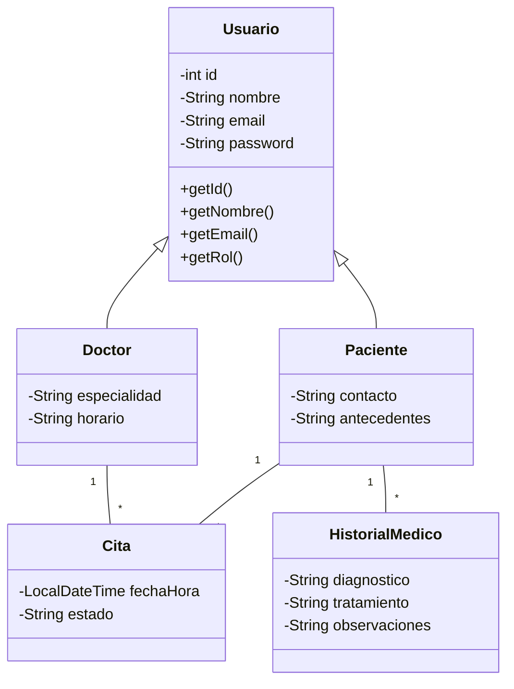

```mermaid
classDiagram
    class Usuario {
        -int id
        -String nombre
        -String email
        -String password
        +getId()
        +getNombre()
        +getEmail()
        +getRol()
    }
    class Doctor {
        -String especialidad
        -String horario
    }
    class Paciente {
        -String contacto
        -String antecedentes
    }
    class Cita {
        -LocalDateTime fechaHora
        -String estado
    }
    class HistorialMedico {
        -String diagnostico
        -String tratamiento
        -String observaciones
    }

    Usuario <|-- Doctor
    Usuario <|-- Paciente
    Doctor "1" -- "*" Cita
    Paciente "1" -- "*" Cita
    Paciente "1" -- "*" HistorialMedico
```